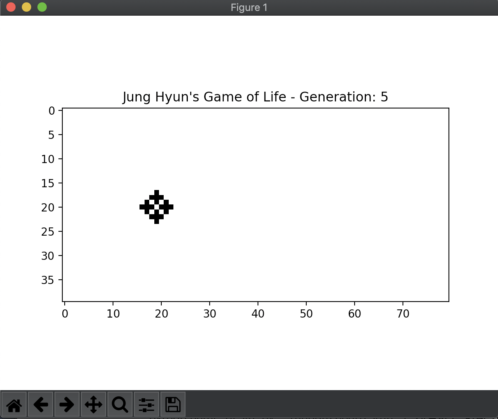

# GameOfLife

## Overview
If you use plus.txt file for argument, you'll see like this result.
</img>

And if you don't use plus.txt file, and try to run random board state, you'll see like this result.
</img>

## Before execute
You have to install the packages before executing the code. Please use this command line.
```$ pip install -r requirements.txt```

## How to execute
gameOfLife.py file can be executed by 3 states.

1. python gameOfLife.py -- starts with random board state and visualize it by generation increases.
2. python gameOfLife.py plus.txt -- starts with the board state which data is given from plus.txt file and visualize it by generation increases.
3. python gameOfLife.py plus.txt 'number' -- starts with the board state which data is given from plus.txt file and visualize it when the generation is over the given number.